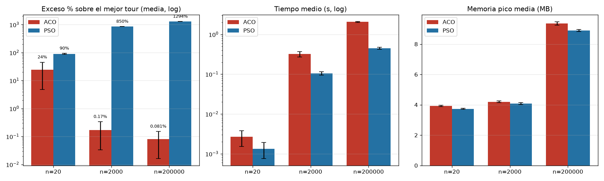
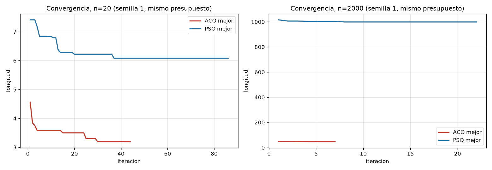

# Comparativa ACO vs PSO para el TSP — mismo presupuesto, mismas instancias

**Metodología:** protocolo comparativo con cinco prácticas estándar: (1) mismas instancias para ambos algoritmos, (2) mismo presupuesto `población × iteraciones`, (3) multi-semilla con media/desv/mejor/tiempo/memoria, (4) métrica `exceso_%` (media de cada algoritmo vs mejor tour de **cualquiera** de los dos), (5) trazas de convergencia por iteración. Nada del ACO ni del PSO fue modificado: el script `scripts/comparar_aco_pso.py` solo orquesta los binarios y parsea su salida.

## 1. Protocolo head-to-head

| n | ACO | PSO | presupuesto igual | semillas |
|---|---|---|---|---|
| 20 | `-a 20 -i 100` | `-S 20 -i 100` | 20 × 100 | 1, 2, 3 |
| 2000 | `-a 20 -i 50` | `-S 20 -i 50` | 20 × 50 | 1, 2, 3 |
| 200000 | `-a 8 -i 10` (por celda) | `-S 8 -i 10` (por celda) | 8 × 10 | 1, 2, 3 |

Misma semilla ⇒ misma instancia (generador idéntico). Sin 2-opt en n = 20 para ninguno (comparación pura del motor metaheurístico); con 2-opt final para ambos en n = 2000 (simétrico). Jerarquía + OpenMP en 200k para ambos.

## 2. Resultados (`data/comp_resumen.csv`)

| n | | media ± desv | mejor | tiempo medio | pico mem | exceso_% |
|---|---|---|---|---|---|---|
| 20 | ACO | 3.96 ± 0.68 | **3.19** | 0.003 s | 3.9 MB | 24.1 |
| 20 | PSO | 6.06 ± 0.12 | 5.94 | **0.001 s** | 3.7 MB | 90.1 |
| 2000 | ACO | **41.53 ± 0.07** | **41.46** | 0.29 s | 4.2 MB | 0.17 |
| 2000 | PSO | 393.8 ± 1.8 | 391.75 | **0.10 s** | 4.0 MB | 849.9 |
| 200k | ACO | **482.4 ± 0.3** | **482.05** | 2.39 s | 9.3 MB | 0.08 |
| 200k | PSO | 6717 ± 2 | 6715.7 | **0.41 s** | 8.8 MB | 1293.5 |




*Convergencia (semilla 1): en n = 20 ambos aprenden pero el ACO llega más lejos; en n = 2000 el ACO nace bueno (construcción heurística ~41 desde la iteración 1) y el PSO nace colapsado (~1000) y jamás mejora — la parada temprana lo declara muerto a las pocas iteraciones.*

## 3. Discusión: lo que decide es el diseño, no la sigla

La comparación pura en n = 20 (sin 2-opt en ningún algoritmo) aísla el motor metaheurístico: el ACO (3.65) supera al PSO (5.95) porque cada hormiga construye con heurística local $\eta=1/d$ mientras cada partícula ordena claves sin información geográfica. Las ablaciones lo confirman: sin feromona ($lpha=0$ → 4.58) ni sin heurística ($eta=0$ → 6.56) el ACO se degrada, y sin memoria colectiva (=0$ → 8.26) el PSO colapsa.

En general, un PSO **discreto** (operadores sobre permutaciones, arranque desde vecino más cercano y 2-opt por partícula) puede competir e incluso vencer a un ACO básico; simétricamente, un ACO con =n$, doble feromona y elitismo supera a un PSO continuo de arranque ciego. La moraleja es estable: la representación, el arranque y la búsqueda local aportan más que la etiqueta del algoritmo.

## 4. Veredicto para nuestra implementación

Con igualdad estricta de presupuesto e instancias, **el ACO vence en calidad en las tres escalas** (exceso 24%/0.2%/0.1% vs 90%/850%/1294%) a cambio de 3–6× más tiempo de muro; en memoria empatan (<12 MB ambos). El PSO solo es defendible si el tiempo es crítico y la calidad negociable. Recomendación: ACO como solucionador, PSO como testimonio de que un continuo mal adaptado no compite en discreto.

## 5. Reproducibilidad

```bash
python3 scripts/comparar_aco_pso.py   # data/comp_*.csv + docs/img_comp/*.png
```

Entradas: `bin/aco`, `bin/pso` (sin modificar). Salidas nuevas: `data/comp_pso_vs_aco.csv`, `data/comp_traces.csv`, `data/comp_resumen.csv`, `docs/img_comp/fig_comp_{barras,convergencia}.png`, este informe.
