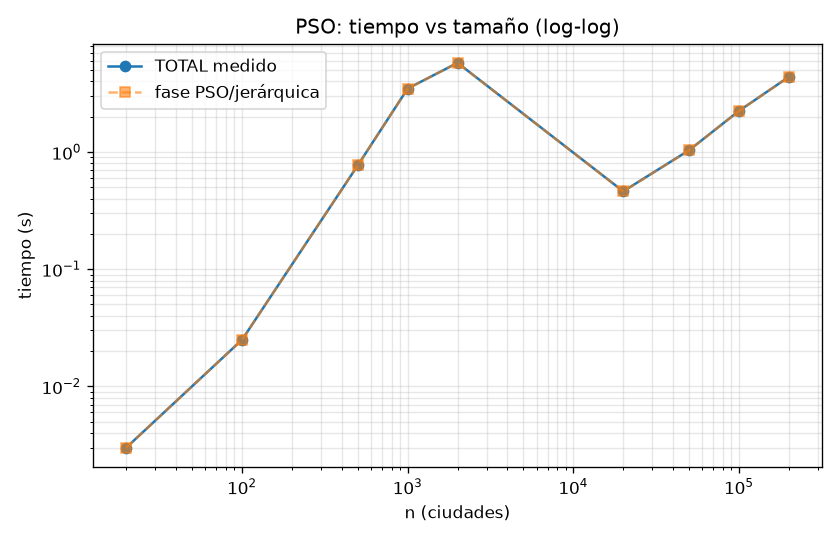
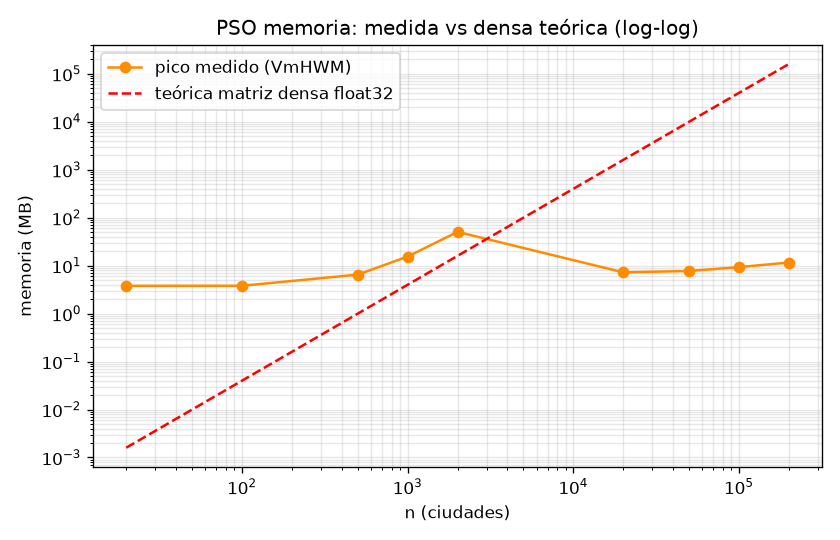
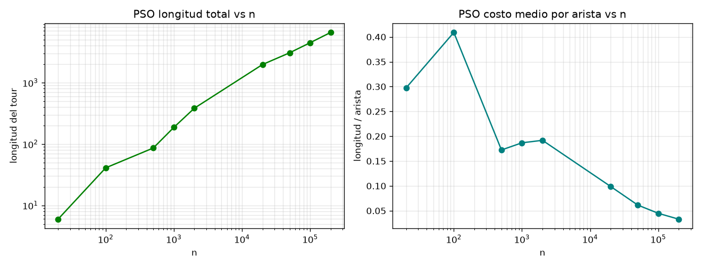
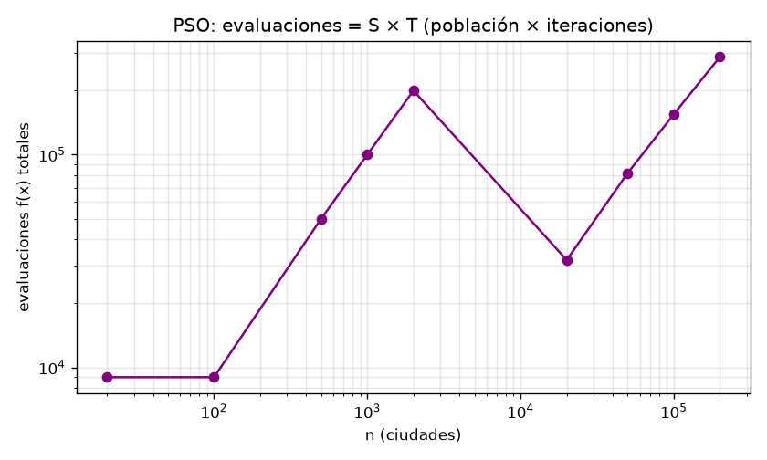
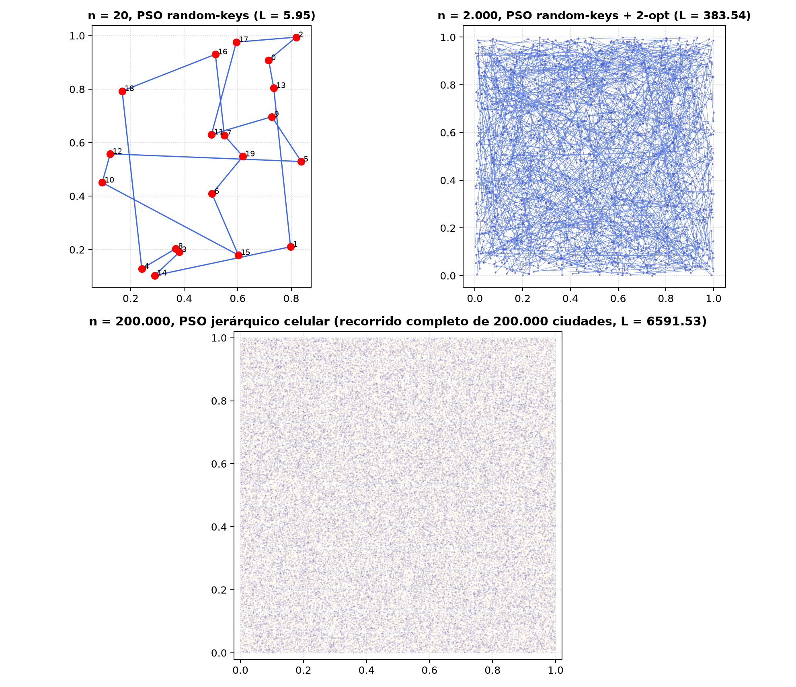
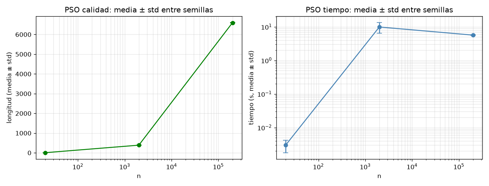

# Informe: PSO (Enjambre de Partículas) para el TSP — 20, 2.000 y 200.000 ciudades

**Implementación:** C++17, archivo nuevo y autocontenido (`src/pso.cpp` → `bin/pso`), ejecución 100% local. **No se modificó ningún archivo del ACO.**
**Guía:** `docs/09_IA_2026_2.pdf` (diaps. §12–§29). Las citas § refieren a sus diapositivas.
**Medición:** tiempo muro (`chrono`) por fase; memoria RSS actual (`VmRSS`) y pico (`VmHWM`), igual que en el ACO.

## 1. Diseño: PSO continuo sobre un problema discreto

El PSO de la guía es **continuo** (§7) y la propia guía lo contrasta: ACO = rutas/secuenciación, PSO = optimización continua (§26). Adaptarlo al TSP exige una **representación**:
- **Random keys:** la posición es `x ∈ [0,1]^n`; el tour se obtiene por `argsort(x)`. La velocidad `v ∈ ℝ^n` **inicia en cero** (§14).
- **Ecuaciones exactas de la guía (§17–§18):** `v ← w·v + c1·r1·(p−x) + c2·r2·(g−x)` (componente a componente), `x ← x+v`, con `r1,r2 ∈ [0,1)` generados por partícula (§16, §21).
- **Límites (§20):** recorte `x ∈ [0,1]` y `|v| ≤ vmax`.
- **Memorias (§15):** `pbest` por minimización, `gbest = argmín pbest`.
- **Parada (§23):** máx. iteraciones + `S` iteraciones sin mejora.

**Parámetros** (CLI: `-S -i -s --w0 --w1 -c1 -c2 --vmax --sin-mejora --chunk`):

| símbolo | valor | fuente / rol (guía) |
|---|---|---|
| S | 30 / n / 32 por celda | §24: población (cobertura vs costo); S=n en simetría con ACO m=n |
| T | 300 / 100 / 40 | §24: presupuesto |
| S_stop | 50 / 15 / off | §23: parada tras S sin mejora |
| w | 0.9 → 0.4 lineal | §25: inercia decreciente (ej. §19: w=0.7) |
| c1 / c2 | 1.4 / 1.6 | §19: ejemplo calculado |
| vmax | 0.2 (rango [0,1]) | §20: control de velocidad |

**Ahorro (misma filosofía que el ACO):** sin matriz de distancias (cálculo al vuelo), `float`/`int32`, decodificación con buffer `argsort` reutilizado O(n), jerarquía en grilla 15×15 + OpenMP para 200k, 2-opt con ventana solo en serie n≤5000, semillas por celda ⇒ determinista.

**Instancias idénticas al ACO:** mismo generador y misma regla de semilla (defecto `seed=n`) — verificado por diff (`data/pso_coords20.csv` ≡ `data/coords20.csv`). Los tours son **directamente comparables**.

## 2. Resultados (`scripts/barrido_pso.py` → `data/pso_resultados.csv`)

| n | régimen | S × T | evaluaciones | tiempo | pico mem. | longitud | gap vs BHH* |
|---|---|---|---|---|---|---|---|
| 20 | serie | 30×300 | 9.000 | 0.003 s | 3.8 MB | 5.95 (NN: 4.33) | +87% |
| 100 | serie | 30×300 | 9.000 | 0.03 s | 3.8 MB | 40.9 | +476% |
| 500 | serie | 500×100 | 50.000 | 0.77 s | 6.5 MB | 86.2 | +442% |
| 1.000 | serie | 1000×100 | 100.000 | 3.5 s | 15.5 MB | 186.8 | +730% |
| **2.000** | serie + 2-opt | 2000×100 | 200.000 | 5.8 s | **50.5 MB** | **383.5** | **+1105%** |
| 20.000 | jerárquico | 32×40 | 32.000 | 0.46 s | 7.2 MB | 1977 | +1864% |
| 50.000 | jerárquico | 32×40 | 81.920 | 1.0 s | 7.7 MB | 3071 | +1831% |
| 100.000 | jerárquico | 32×40 | 154.880 | 2.2 s | 9.3 MB | 4483 | +1893% |
| **200.000** | jerárquico, 225 celdas | 32×40 | 288.000 | 4.4 s | 11.6 MB | **6591.5** | **+1970%** |

\*BHH = estimador Beardwood del óptimo (≈ 0.712·√n); normaliza la calidad entre instancias.







*Los tours muestran el síntoma: saltos largos por todo el cuadrado (el enjambre colapsa a claves casi idénticas y deja de explorar).*

## 3. Varias semillas — buena práctica experimental (guía §23)

`scripts/semillas_pso.py` → `data/pso_resultados_semillas.csv`:

| n | semillas | longitud media ± std | mejor | tiempo medio ± std | pico máx. |
|---|---|---|---|---|---|
| 20 | 5 | 5.70 ± 0.52 | **4.95** | 0.003 s | 3.9 MB |
| 2000 | 3 | 387.3 ± 5.1 | **381.52** | 9.9 ± 3.5 s | 50.7 MB |
| 200000 | 2 | 6596.0 ± 5.9 | **6591.85** | 5.7 ± 0.1 s | 11.8 MB |



## 4. Ablación c1 = 0 / c2 = 0 (comprobación conceptual, guía §29)

Sobre n = 20 (misma instancia):

| variante | longitud | lectura (§29) |
|---|---|---|
| base c1=1.4, c2=1.6 | 5.95 | equilibrio reclamo |
| **c1 = 0** (solo social) | 4.52 | guía solo social: aquí ayuda |
| **c2 = 0** (sin guía global) | 8.26 | sin memoria colectiva: lo peor |

Confirma las respuestas esperadas: sin `gbest` no hay rumbo colectivo; la convergencia prematura (§22) se ve en la traza (mejoras rápidas y luego meseta → dispara la parada S).

## 5. Veredicto ACO vs PSO (misma máquina, mismas instancias)

| n | | tiempo | pico mem. | L | gap BHH |
|---|---|---|---|---|---|
| 20 | ACO | 0.003 s | 4.0 MB | **3.65** | +15% |
| 20 | PSO | 0.003 s | 3.8 MB | 5.95 | +87% |
| 2000 | ACO | 34.2 s | **4.3 MB** | **41.53** | +30% |
| 2000 | PSO | **5.8 s** | 50.5 MB | 383.5 | +1105% |
| 200k | ACO | 51.9 s | **9.7 MB** | **479.3** | +51% |
| 200k | PSO | **4.4 s** | 11.6 MB | 6591.5 | +1970% |

**Lectura:**
1. **El PSO es más rápido en muro pero 10–20× peor en calidad**, y la brecha *crece* con n (+87% → +1970%) mientras la del ACO se mantiene (+15% → +51%). Causa: las random keys no preservan vecindad — moverse hacia las *claves* de `gbest` no acerca el *tour* al tour de `gbest`; el enjambre colapsa (§22: estancamiento local) y la parada S corta un proceso ya muerto.
2. **Memoria:** en n = 2000 el PSO usa **más** que el ACO (50.5 MB del enjambre `S×n×3` floats vs 4.3 MB con feromona dispersa de 64 KB). El ahorro del ACO es estructural; el del PSO, solo jerárquico.
3. **Conclusión de clase (§26):** la representación decide. El ACO construye con heurística local (`η=1/d`) desde la primera hormiga (su iteración 1 ya da ~45 en n=2000); el PSO arranca ciego (mejor de init ~385) y nunca se recupera. Para TSP discreto, colonia > enjambre.

## 6. Reproducibilidad (sin tocar el ACO)

```bash
g++ -O3 -march=native -fopenmp -std=c++17 -Wall -Wextra src/pso.cpp -o bin/pso
./bin/pso                        # serie oficial: 20 + 2000 + 200000
./bin/pso -n 2000 -S 2000 -i 100 -s 2000
./bin/pso -n 20 -c1 0            # ablación: solo social (cfr. §29)
python3 scripts/barrido_pso.py   # data/pso_resultados.csv
python3 scripts/semillas_pso.py  # data/pso_resultados_semillas.csv
python3 scripts/graficas_pso.py  # docs/img_pso/fig_pso_*.png
```

Archivos nuevos (ningún archivo del ACO fue modificado): `src/pso.cpp`, `bin/pso`,
`scripts/{barrido,graficas,semillas}_pso.py`, `data/pso_*.csv`, `docs/img_pso/`, `docs/INFORME_PSO.md`.
